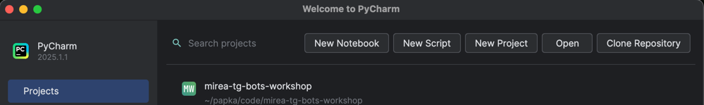
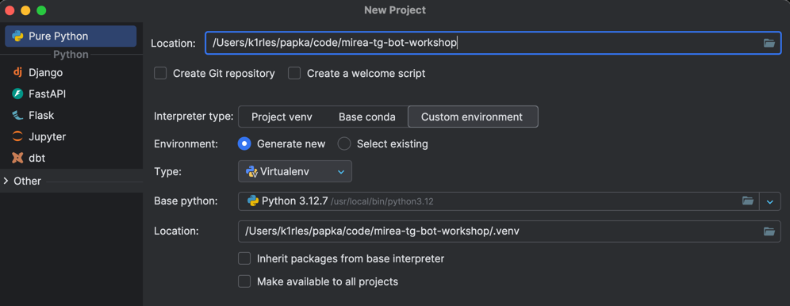
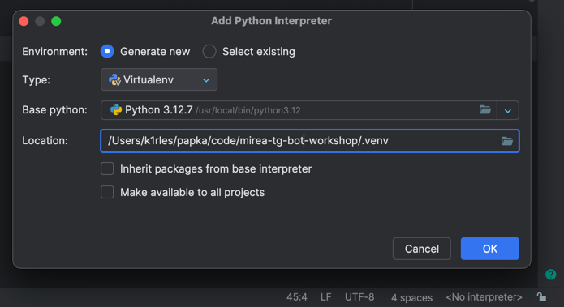

# Мастер-класс «Создаём Telegram бота» в рамках приёмной кампании РТУ МИРЭА 2025

## Часть 1. Знакомство с ведущим

Я - Лесовой Кирилл, студент 1 курса РТУ МИРЭА по направлению [ПИ РППиПИС](https://priem.mirea.ru/guide-direction?direction_id=1207)

Зимой 2024-2025 написал [тг-бота для Дня студента](https://github.com/K1rL3s/mirea-student-day), и поэтому меня позвали провести этот мастер-класс.

Начал свой путь разработчика в 9 классе, попав в Яндекс Лицей на двухгодичный курс ([тык](https://lyceum.yandex.ru/python) и [тык](https://lyceum.yandex.ru/industrial)). \
В школьное время писал ботов, бэкенды для сайтов, участвовал и побеждал в хакатонах. В апреле устроился в [Велобайк](https://velobike.ru) разработчиком внутреннего отдела автоматизации, основные обязанности - проверка фич через тг-бота и интеграция с различными сервисами.

Мои контакты [тут](https://hello.k1rles.ru), этот репозиторий [тут](https://github.com/K1rL3s/mirea-tg-bot-workshop)


## Часть 2. Введение в чат-боты

Telegram - это мессенджер, основанный Павлом и Николаем Дуровыми в 2013 году. \
Скорее всего, вы уже им давно пользуетесь. Я скачал его во время блокировок в 2018 году, и с тех пор использую его как основное приложение для общения. \
В телеге есть боты (чат-боты) - по сути, это программы, которые взаимодействуют с пользователями через текстовые или мультимедийные сообщения, в основном для автоматизации чего-то.

Зачем они нужны?
- Автоматизация рутинных задач (например, просмотр расписания занятий).
- Улучшение взаимодействия с клиентами (техподдержка, заказы).
- Развлечения и интерактив (игры, викторины).
- Сбор данных и аналитика (опросы, анкеты).

Мы с вами не будем пытаться решить какую-то существующую проблему, сегодня наша цель - понять функционал тг-ботов и научиться применять его как разработчики.

_Вопросы к аудитории:_
- _Кто знаком с программированием? (например, ОГЭ/ЕГЭ по информатике, КуМир, Pascal, Python)._
- _Писали ли что-то на Python? Участвовали ли в олимпиадах или хакатонах?_


## Часть 3. Выбор инструментов

Не долго думая, берём Python из-за его простоты и низкого порога входа, и aiogram как самую совершенную библиотеку для тг-ботов на питоне.
Ещё нам понадобится база данных (о ней дальше). Мы возьмём sqlite, чтобы не разворачивать постгрю или мускуль на университетских компах.


## Часть 4. Настройка PyCharm, нового проекта, venv

1. Открываем PyCharm
2. Выбираем **Create new project** на стартовом экране
    
3. Называем как хотим (я назвал его `mirea-tg-bot-workshop`) и создаём
    
4. Справа снизу создаём виртуальное окружение с питоном 3.9+
    

Так как нам нужен будет aiogram, установим его, введя следующую команду в терминал:
```commandline
pip install aiogram
```

## Часть 5. Эхо-бот. Первый запуск

Чтобы у нас был бот, его нужно создать. Пишем [ему](https://t.me/BotFather), пишем `/newbot`, придумываем имя и юзернейм для бота. Копируем токен, он нам пригодится совсем скоро.

В корне проекта создаём файл `main.py` (у меня это `mirea-tg-bot-workshop/main.py`) и пишем в него код: [тык](./5-echo-bot/1.py)

Запускаем бота (зеленая стрелочка справа сверху) и что-то пишем ему через телеграм. В ответ должны получить такое же сообщение.

Сейчас при работе бота в терминал нам ничего не выводится. Чтобы было понятнее, работает ли бот, добавим одну волшебную строку: [тык](./5-echo-bot/2.py)

И теперь сделаем всё чуть красивее: [тык](./5-echo-bot/3.py)


## Часть 6. Обработка команд

Как вы уже поняли после взаимодействия с BotFather, ботом можно управлять с помощью команд. \
В аиограме есть несколько способов обработки сообщений с командами: [тык](6-commands/1.py)

Самый банальный:
```python
from aiogram import F

@dp.message(F.text == "/start")
```

Уже лучше:
```python
from aiogram.filters import Command

@dp.message(Command("start"))
```

И специально для старта:
```python
from aiogram.filters import CommandStart

@dp.message(CommandStart())
```

Кто такой `F`? Это буквально "магический фильтр", через который удобно фильтровать события в аиограме.

Как им пользоваться? Просто представьте, что вместо него стоит обрабатываемое событие (Message, CallbackQuery итп), и обращайтесь к его атрибутам. \
В первом примере я использовал `F.text == "/start`, что буквально `message.text == "/start"` (проверка, что пользователь отправил боту сообщение с текстом "/start")

Теперь, зная как обрабатывать команды, добавим хэндлер (обработчик) для старта и помощи: [тык](./6-commands/2.py)


## Часть 7. Клавиатуры: Inline и Reply

В тг-ботах в основном используют два вида событий - сообщения и callback-кнопки. \
Reply-клавиатуры работают через сообщения - жмёшь на кнопку и отправляется сообщение с текстом кнопки. Начнём с них: [тык](./7-keyboards/1.py)

Inline-клавиатуры уже работают через callback'и: по нажатию на кнопку боту отправляется специальное событие CallbackQuery: [тык](./7-keyboards/2.py)


## Часть 8. Настройка локальной базы данных

Что такое база данных? Упрощая, это таблица в Excel, где лист = таблица, строка = запись, и чётко определена схема. Схема определяет, что в таблицах записи должны содержать определённую информацию в определённом порядке.

То есть мы создаём базу `database.db`, создаём таблицу `users` с колонками `id`, `name`, и теперь у всех юзеров в базе обязаны быть айдишник и имя.

Для просмотра содержимого базы можно открыть её через `DB Browser for SQLite` или через `python -m sqlite3 ./database.db`

Кто такой SQLite? Это база данных, которая хранится одним файлом там где надо. Она удобна тем, что не требует установки каких-либо программ для работы с ней.

Кто такой SQL? Structured Query Language, язык структурированных запросов - язык для общения с базой данных. Как питон для бэкендов, так и скл для базы данных. \
Пока нам надо запомнить, что с его помощью скулайт сохраняет, обновляет и достаёт нам информацию из файла базы данных.

Напишем класс с двумя (тремя) методами: сохранение пользователя и получение пользователя: [тык](./8-database/database.py)


## Часть 9. Сбор данных о пользователе

Так как мы хотим знать, кто пользуется нашим ботом, будем на старте спрашивать у юзеров их имя и возраст.
Делается это через аиограмовский FSM (Finite State Machine, машина состояний)

Обновим метод сохранения юзера в базу: [тык](./9-fsm/database.py) 

Сделаем пошаговый сценарий сбора информации: [тык](./9-fsm/1.py)

